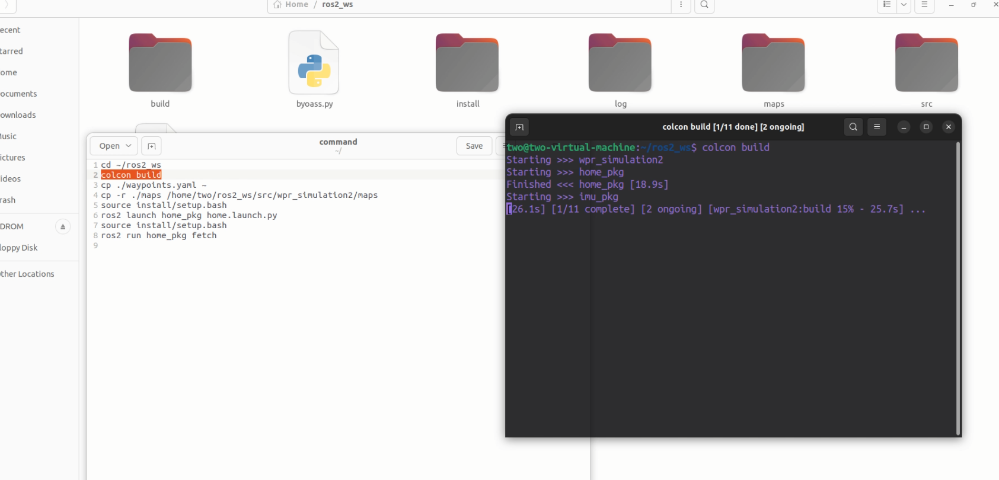
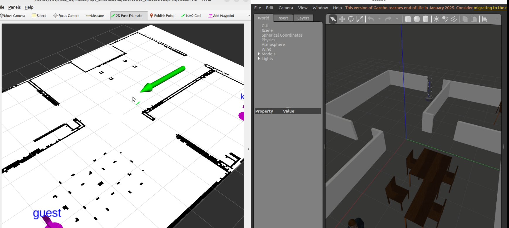
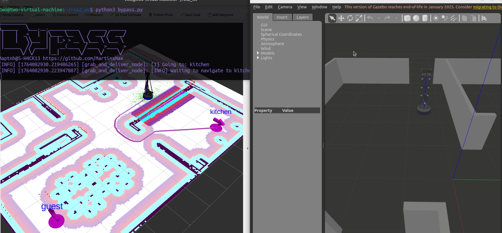
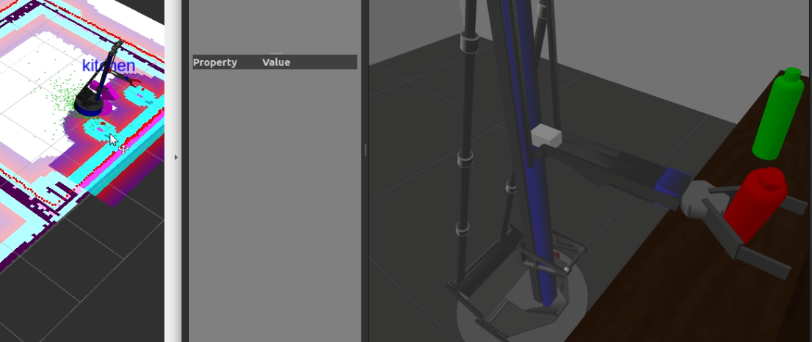
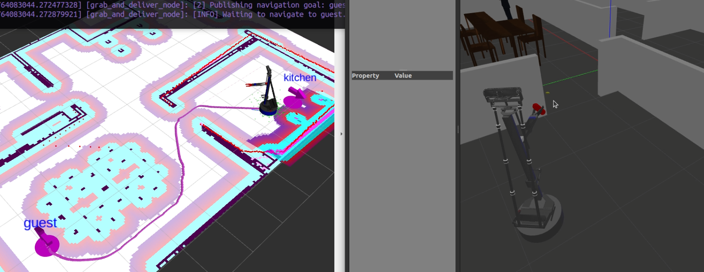
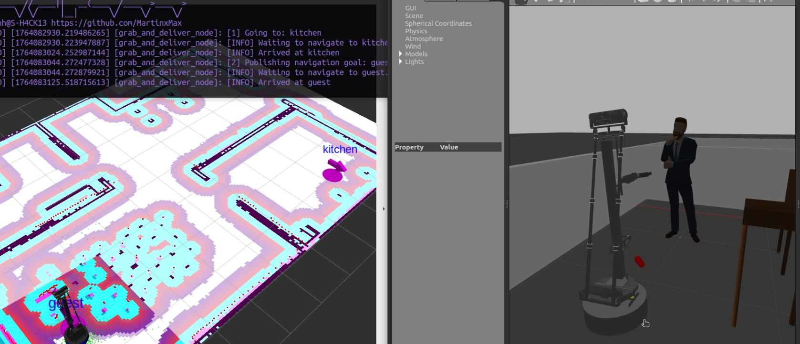

 
# ROS2 Delivery Bypass Script

[+] This script fixes the **bottle pickup failure bug** in ROS2 delivery.

For detailed technical analysis, please refer to the PDF:
[+] Official program defect analysis
[+] Subscription node bypass

---

# Build & Run

```bash
$ cd ~/ros2_ws
```

```bash
$ colcon build
```

---



Load the map:

```bash
$ cp ./waypoints.yaml ~;cp -r ./maps /home/two/ros2_ws/src/wpr_simulation2/maps
```

Load the environment:

```bash
$ source install/setup.bash
```

Launch the simulation:

```bash
$ ros2 launch home_pkg home.launch.py
```

---

Add robot orientation:



Start the exploit tool:

```bash
$ python3 bypass.py
```

---









---
 
